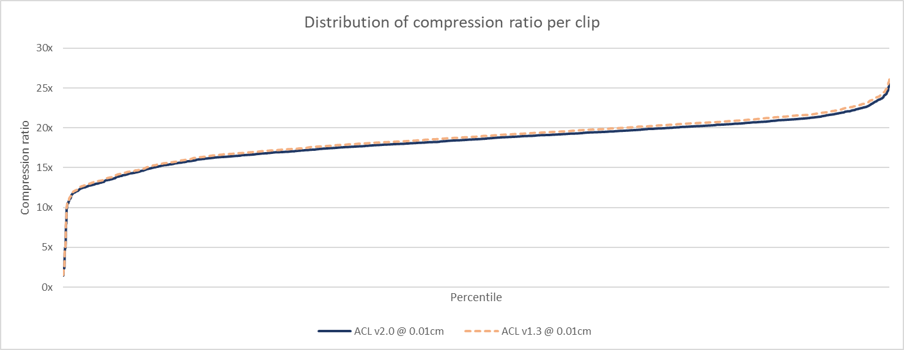
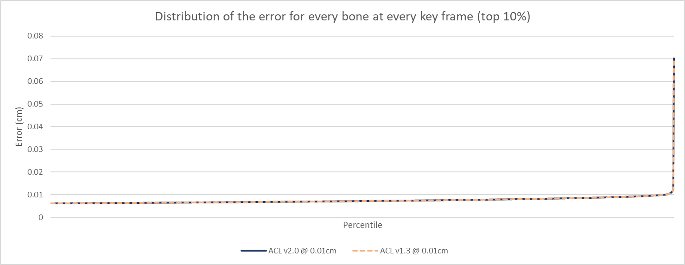
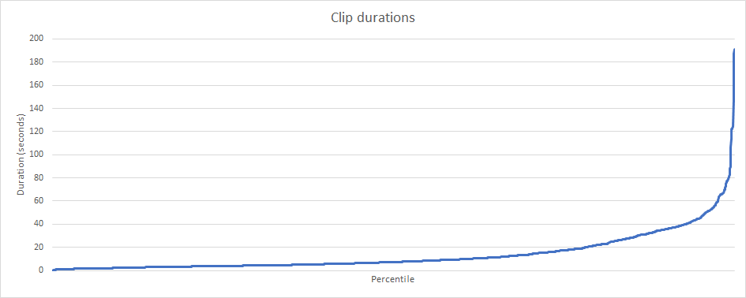

# Carnegie-Mellon University database performance

To compile the statistics, the [animation database from Carnegie-Mellon University](http://mocap.cs.cmu.edu/) is used.
The raw animation clips in FBX form can be found on the Unity asset store [here](https://www.assetstore.unity3d.com/en/#!/content/19991).
They were converted to the [ACL file format](the_acl_file_format.md) using the [fbx2acl](../tools/fbx2acl) script. Data available upon request, it is far too large for GitHub.

*  Number of clips: **2534**
*  Sample rate: **24 FPS**
*  Total duration: **09h 49m 37.58s**
*  Raw size: **1429.38 MB** (10x float32 * num bones * num samples)

For ACL and Unreal 4, the error is measured **3cm** away from each bone to simulate the visual mesh skinning process as described [here](error_metrics.md).

*  [ACL](cmu_performance.md#acl)
*  [Unreal 4](cmu_performance.md#unreal-4)
*  [Results in images](cmu_performance.md#results-in-images)

# ACL

Statistics for ACL are being generated with the `acl_compressor` tool found [here](../tools/acl_compressor). It supports various compression methods but only the overall best variant will be tracked here: variable bit rate with range reduction enabled. Every clip uses an error threshold of **0.01cm (0.1mm)**.

*  Compressed size: **67.02 MB**
*  Compression ratio: **21.33 : 1**
*  Max error: **0.0703** centimeters (clip *122_11*)
*  Compression time: **00h 36m 27.22s** (single threaded)
*  Compression time: **00h 11m 03.60s** (multi threaded on 4 cores)

Note that you can compress any number of clips in parallel with multiple threads but each clip uses a single thread for now.

**Results from release [0.8.0](https://github.com/nfrechette/acl/releases/tag/v0.8.0)**

See [here](cmu_performance_history.md) for a history of performance progress across the various releases.

# Unreal 4

In order to measure statistics in *Unreal 4*, ACL was integrated along with a small [commandlet](../tools/ue4_stats_dump) to run the necessary compression and decompression logic. Everything uses the default values from the automatic compression settings which performs an exhaustive search of the best compression variant. As described [here](http://nfrechette.github.io/2017/01/11/anim_compression_unreal4/), the automatic compression tries many algorithms and settles on the best memory footprint that is also under the desired error threshold. The default error threshold is **1.0cm** but here we used **0.1cm** which is more realistic for production use.

*  Compressed size: **108.00 MB**
*  Compression ratio: **13.23 : 1**
*  Max error: **0.0785** centimeters (clip *88_06*)
*  Compression time: **02h 51m 20.21s** (single threaded)

Sadly the *Unreal 4* compression logic does not *yet* support multi-threading and must be run from the main thread.

*Note: Down-sampling variants were causing issues and were disabled in the interest of keeping things fair. This speeds up the compression time considerably but does not affect the compressed size much.*

**Results from Unreal 4.15.0**

# Results in images

