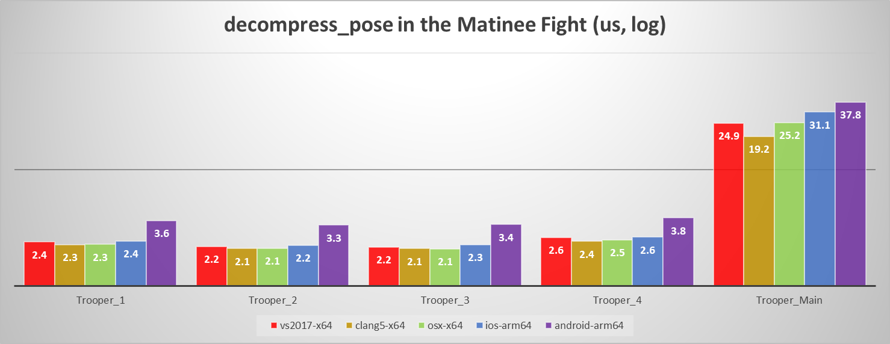

# Decompression performance

In order to measure the decompression performance, the [acl_decompressor]() tool is used to extract the relevant metrics and a [python script]() is used to parse them.

Here are the clips we measure on:

*  The 42 [regression clips]() from [CMU]() database
*  The 5 clips from the [Matinee fight]() scene

Note that the data is not yet publicly available.

Here are the platforms we measure on:

*  Desktop: Intel i7-6850K @ 3.8 GHz
*  Laptop: MacBook Pro mid 2014 @ 2.6 GHz
*  Phone: Android Nexus 5X @ 1.8 GHz
*  Tablet: iPad Pro 10.5 inch @ 2.39 GHz

We only show a few compilers and architectures to keep the graphs readable. The *Visual Studio 2017* numbers are nearly identical to *Visual Studio 2015* and are omitted for that reason. *GCC 7* lands in between *VS 2015* and *Clang 5* and is omitted. Only *VS 2015* is shown for *x86* because it is generally a bit slower than the *x64* variant for all compilers and it isn't commonly used in games.

## Uniformly sampled algorithm

The uniformly sampled algorithm offers consistent performance regardless of the playback direction. Shown here is `decompress_pose` with a cold CPU cache: forward is **Red**, backward is **Green**, and random is **Blue**.

### decompress_pose

This function decompresses a whole pose in one go. Shown here is forward playback with a cold CPU cache.

### decompress_bone

This function decompresses a single bone. To generate the graphs, we measure the cost of decompressing a whole pose one bone at a time. Shown here is forward playback with a cold CPU cache.

